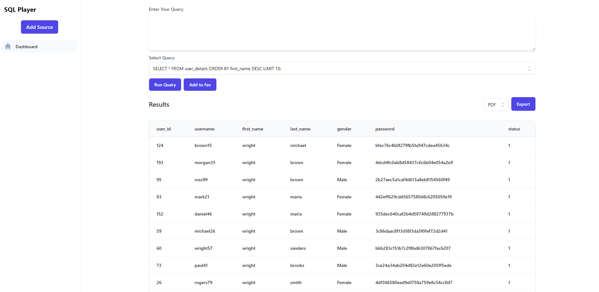
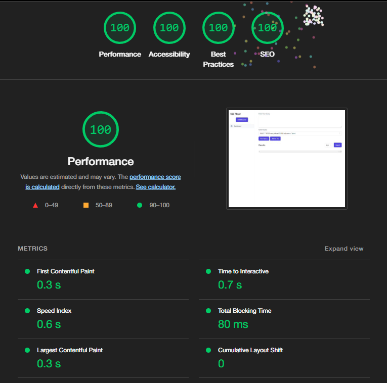

  


# SQL Runner

A in Browser SQL runner for querying SQL DB

built with

- NextJS
- TailwindCSS
- Prisma
- Supabase


## Screenshots




## Features

- Runs predefined SQL queries
- Can Export data to CSV and PDF
- Add Query to Favourites

## Predefined queries

- Select from userdetails table with limit 5
- Select from table with name john limit 5 and order desc
- Select from table with firstname john
- Select from table with lastname john
- Select from table with limit 200

## Page Load Times

Achieved 100 in all the lighthouse tests



- **First Contentful Paint** marks the time at which the first text or image is painted
- **Time to interactive** is the amount of time it takes for the page to become fully interactive.
- **Speed Index** shows how quickly the contents of a page are visibly populated.
- **Total Blocking Time** is the sum of all time periods between FCP and Time to Interactive, when task length exceeded 50ms, expressed in milliseconds.
- **Largest Contentful Paint** marks the time at which the largest text or image is painted.
- **Cumulative Layout Shift** measures the movement of visible elements within the viewport.

## Deployment

To deploy this project run


```bash
  npm run build-prod
```

this will run eslint and type checks as well as run all the tests before building an optimized production build
